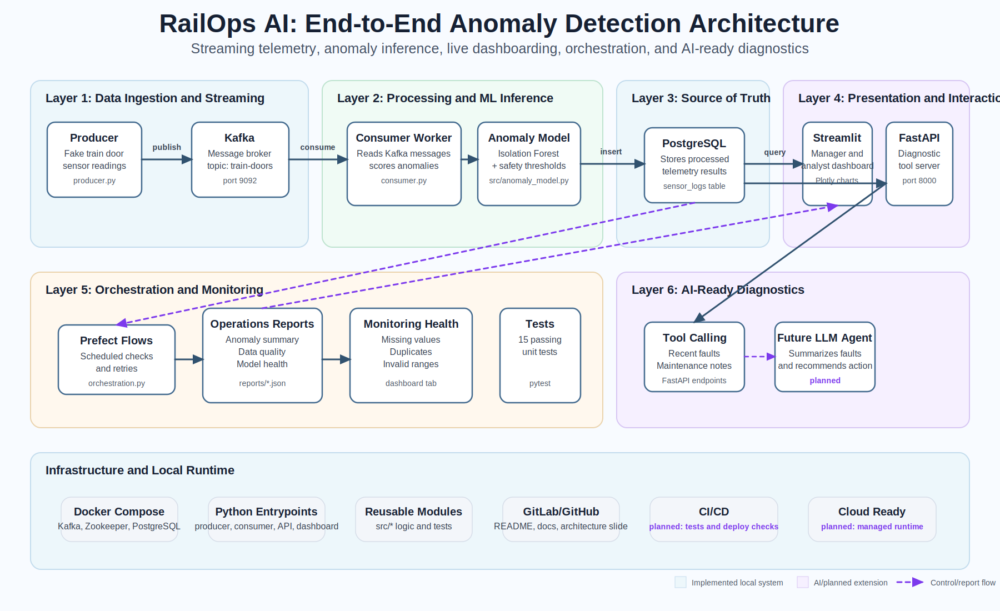

# RailOps AI: Train Anomaly Pipeline

A portfolio project that shows how train door sensor data can be monitored in real time, checked for anomalies, stored, summarized, and presented through a manager-ready operations dashboard.

The system simulates train door telemetry, streams the readings through Kafka, scores each reading with anomaly detection logic, stores the enriched results in PostgreSQL, and uses Streamlit + Plotly to show live operational status.

## What This Project Does

This project models a simple railway monitoring workflow:

1. Simulated train door sensor readings are generated.
2. The readings are streamed into a real-time messaging system.
3. Each reading is checked for abnormal behaviour.
4. Results are saved into a database.
5. Prefect flows create anomaly, data quality, and model health reports.
6. A dashboard shows recent readings, anomaly status, monitoring health, and diagnostic context.
7. A FastAPI diagnostic service exposes data that a future LLM agent can summarize.

The goal is to demonstrate how real-time data pipelines can support condition monitoring, early fault detection, and maintenance decision-making.

## Architecture



In plain language:

- **Producer** creates fake train door sensor readings.
- **Kafka** acts like a live conveyor belt for messages.
- **Zookeeper** coordinates Kafka in this local setup.
- **Consumer** reads messages, runs anomaly detection, and writes enriched results.
- **PostgreSQL** is the source of truth where processed data is stored.
- **Prefect** runs scheduled monitoring workflows and writes report snapshots.
- **Streamlit + Plotly** provide the dashboard and interactive visualizations.
- **FastAPI** exposes diagnostic tools for recent faults and maintenance context.
- **Future LLM agent** can call the FastAPI tools and produce plain-English incident summaries.

## Example Use Case

Imagine a train door begins taking longer than usual to close, or its motor current rises above normal levels.

This pipeline can flag that reading as suspicious and classify it as a possible mechanical, electrical, or operational fault. Maintenance teams could then use the dashboard and diagnostic tools to investigate the issue before it becomes more serious.

## Project Components

| Component | Purpose |
| --- | --- |
| `producer.py` | Simulates train door sensor readings |
| `consumer.py` | Reads the sensor data, checks for anomalies, and saves results |
| `dashboard.py` | Presents manager-ready anomaly status, monitoring health, telemetry, and diagnostic context |
| `mcp_server.py` | Provides simple diagnostic API endpoints |
| `src/` | Reusable telemetry, anomaly model, database, reporting, and visualization modules |
| `tests/` | Tests for telemetry, anomaly scoring, reporting, report loading, and Plotly charts |
| `docs/ARCHITECTURE.md` | Target portfolio architecture and skill map |
| `docs/assets/railops_ai_architecture.svg` | Updated architecture slide |
| `orchestration.py` | Prefect flows for anomaly summaries, model health, and data quality checks |
| `docker-compose.yaml` | Starts the local Kafka and PostgreSQL services |
| `requirements.txt` | Lists the Python packages needed |

## How The System Works Now

```text
Simulated Train Data
        |
        v
Kafka Message Stream
        |
        v
Anomaly Detection Worker
        |
        v
PostgreSQL Database
        |
        +----> Prefect Reports
        |
        +----> Streamlit + Plotly Dashboard
        |
        +----> Diagnostic API Service
```

## Technologies Used

- Python
- Apache Kafka
- PostgreSQL
- Streamlit
- Plotly
- FastAPI
- Scikit-learn
- Prefect
- Docker Compose

## Dashboard Views

The dashboard is organized around decision needs:

| View | Main Question | Audience |
| --- | --- | --- |
| Command Center | Are anomalies happening right now, and where should we look first? | Manager / operations lead |
| Monitoring Health | Can we trust the dashboard and underlying data? | Data analyst / data owner |
| Telemetry Explorer | What do the detailed sensor readings show? | Analyst / engineer |
| AI Diagnostics | What tool outputs can a future AI agent use? | AI engineering demo |

The dashboard uses Plotly for:

- red anomaly markers
- threshold-aware sensor trends
- affected-door charts
- anomaly-type charts
- door-level anomaly heatmaps
- model-health feature charts

## Portfolio Roadmap

This project is being extended into **RailOps AI**, a portfolio project that showcases:

- Data science: anomaly detection, feature metrics, model output, and monitoring
- Data engineering: streaming ingestion, database design, scheduling, and reliability
- AI engineering: tool-calling diagnostics, RAG, structured outputs, and human review
- Product thinking: a dashboard and incident workflow that make anomalies actionable

See [docs/ARCHITECTURE.md](docs/ARCHITECTURE.md) for the target architecture and build phases.
See [docs/PREFECT_ORCHESTRATION.md](docs/PREFECT_ORCHESTRATION.md) for the orchestration runbook.

## Running The Project Locally

### 1. Install Python Dependencies

```bash
python -m venv .venv
source .venv/bin/activate
pip install -r requirements.txt
```

### 2. Configure Environment Variables

Create a `.env` file in the project folder with the required database settings:

```env
POSTGRES_USER=user
POSTGRES_PASSWORD=change_me
POSTGRES_DB=traindb
DB_HOST=localhost
DB_PORT=5432
KAFKA_BOOTSTRAP_SERVERS=localhost:9092
KAFKA_TOPIC=train-doors
DASHBOARD_ALERT_WEBHOOK=http://localhost:8501/alert_webhook
REPORTS_DIR=reports
```

### 3. Start Supporting Services

```bash
docker compose up -d
```

This starts Kafka, Zookeeper, and PostgreSQL.

### 4. Start The Consumer

```bash
python consumer.py
```

This listens to Kafka, scores telemetry, and writes results to PostgreSQL.

### 5. Start The Data Producer

```bash
python producer.py
```

This begins generating simulated train door sensor readings.

### 6. Start The Dashboard

```bash
streamlit run dashboard.py
```

### 7. Start The Diagnostic API

```bash
uvicorn mcp_server:app --reload --host 0.0.0.0 --port 8000
```

### 8. Run Prefect Operations Flows

Generate all local operations reports:

```bash
python orchestration.py all
```

Run individual flows:

```bash
python orchestration.py daily
python orchestration.py quality
python orchestration.py health
```

Start scheduled local deployments:

```bash
python orchestration.py serve
```

Reports are written as JSON files in the `reports/` folder by default.

After generating reports, refresh the Streamlit dashboard:

- **Command Center** shows whether action is needed, how many anomalies were found, and which doors/faults to inspect first.
- **Monitoring Health** shows whether dashboard data is complete, fresh, and trustworthy.
- **Telemetry Explorer** shows detailed sensor readings for analyst inspection.
- **AI Diagnostics** shows API tool outputs that a future LLM agent can summarize.

The dashboard uses Streamlit for the app layout and Plotly for interactive charts with anomaly markers, threshold lines, door-level heatmaps, and model-health visuals.

## Notes

This is a demonstration project. The data is simulated, and the anomaly detection model is trained on generated sample data rather than real historical train telemetry.

For a production system, this would need real sensor data, stronger validation, monitoring, security controls, and a properly trained model.

The LLM/AI agent layer is not fully implemented yet. FastAPI currently exposes diagnostic tools that a future agent can call.

## Run Tests

```bash
pytest
```

## License

Add your chosen license here.
